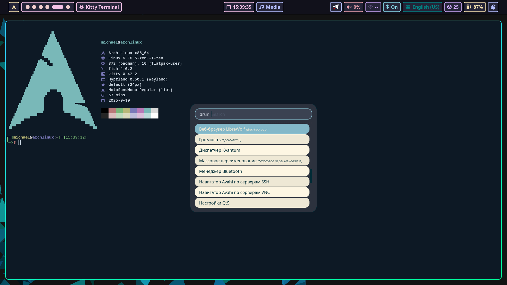

# My dotfiles

  

# Disclaimer: The script is running without any asking of what to install and what not to. It just does get the job done.

## Components:

- Tiling window manager: hyprland
- Audio: pipewire (+alsa)
- Font: Firacode Nerd
- Display manager: sddm
- File manager: thunar
- Network manager: NetworkManager
- Package manager: paru
- Terminal: kitty
- Shell: fish
- Browser: librewolf
- Editor: neovim
- Application launcher: rofi
- Status bar: hyprpanel
- Node manager: fnm
- Bootloader: grub
- cd alternative: zoxide (aliased to `cd`)
- ls alternative: eza

## Themes:

- Sddm: Silent theme
- Grub: Elegant theme
