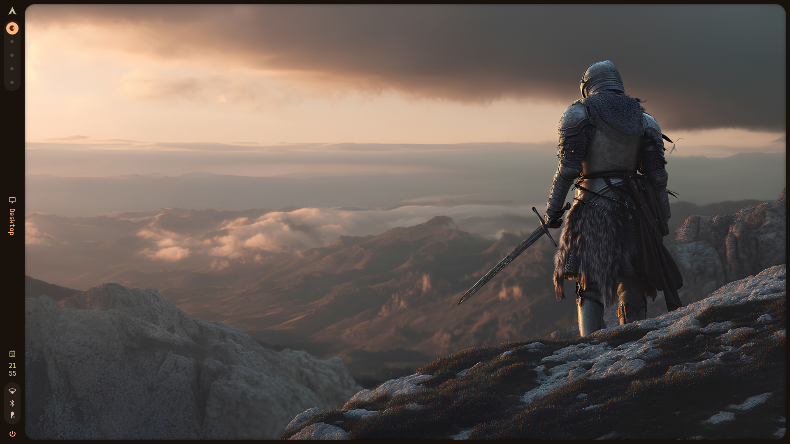
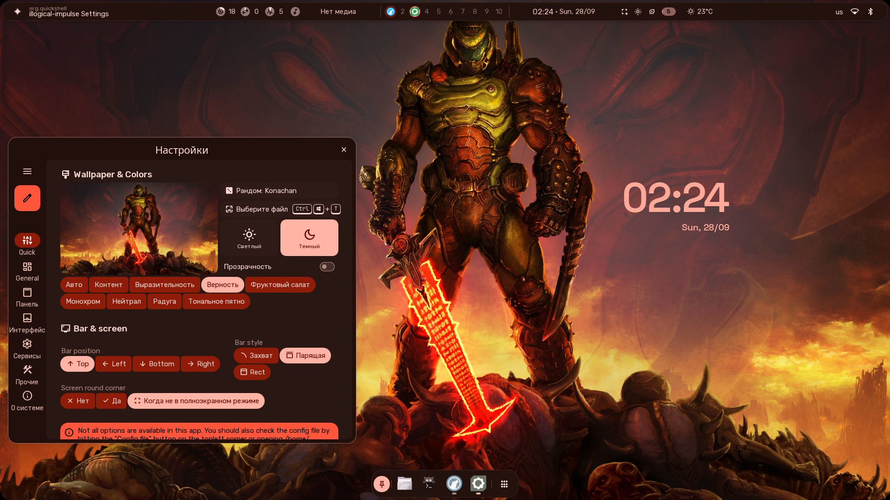

# Hyprland dotfiles

- [Components](#components)
- [Installation](#installation)
- [Update](#update)
- [Uninstallation](#uninstallation)

<p align="center">
  
  
</p>

## Components

- Tiling window manager: hyprland
- Audio: pipewire
- Display manager (login program): sddm
- File manager: dolphin
- Network manager: NetworkManager
- Package manager: yay
- Terminal: kitty
- Shell: fish
- Browser: librewolf
- Editor: neovim
- Visual environment: [end4-dots-hyprland](https://github.com/end-4/dots-hyprland)
- Node manager: fnm
- cd alternative: zoxide (aliased to `cd`)
- ls alternative: eza (aliased to `ls`)

## Installation

```
git clone https://github.com/Dexter2038/dexdots $HOME/.dotfiles
cd $HOME/.dotfiles
./install.sh
```

## Update

Why not `update.sh`?
It is not ready yet.

```
cd $HOME/.dotfiles
git pull
./install.sh
```

## Uninstallation

Disclaimer: script is kinda destructive because it removes not just installed components but every dependency of them

```
cd $HOME/.dotfiles
./uninstall.sh
```
