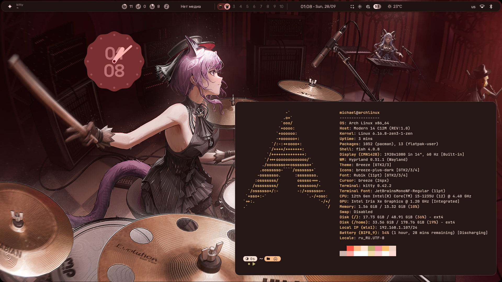

# Hyprland dotfiles based on [caelestia-dots](https://github.com/caelestia-dots/caelestia)

<!--toc:start-->
- [Hyprland dotfiles based on [caelestia-dots](https://github.com/caelestia-dots/caelestia)](#hyprland-dotfiles-based-on-caelestia-dotshttpsgithubcomcaelestia-dotscaelestia)
  - [Components](#components)
  - [Themes](#themes)
  - [Additional screenshots](#additional-screenshots)
<!--toc:end-->

  

## Components

- Tiling window manager: hyprland
- Audio: pipewire
- Display manager (login program): sddm
- File manager: thunar
- Network manager: NetworkManager
- Package manager: paru
- Terminal: foot
- Shell: fish
- Browser: librewolf
- Editor: neovim
- Application launcher, status bar: [caelestia-shell](https://github.com/caelestia-dots/shell)
- Node manager: fnm
- cd alternative: zoxide (aliased to `cd`)
- ls alternative: eza (aliased to `ls`)

## Themes

- Sddm: Astronaut theme

## Additional screenshots

  
  
  
  
  
  
  
  
  
  
  
  

